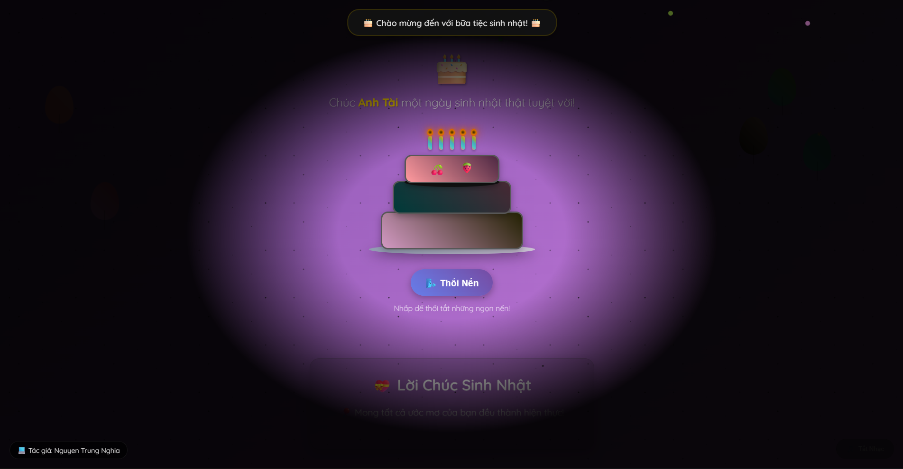
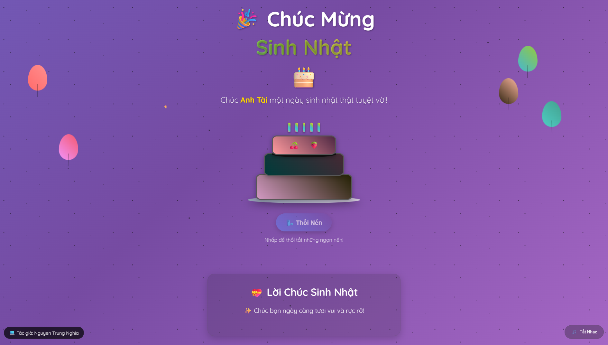

# 🎉 Happy Birthday - 誕生日おめでとうウェブサイト 🎂

**🌐 ウェブサイト: [https://nguyentrungnghia1802.github.io/Happy-Birthday/](https://nguyentrungnghia1802.github.io/Happy-Birthday/)**

  
   
	
	

	<i>家族や友人に贈るバースデーWebサイトの画面例</i>

---

## なぜこのウェブサイトを作ったのか？

毎年、家族や友人に同じようなプレゼントを繰り返し贈ることに少し飽きてしまい、もっと心に残るサプライズを届けたいと思いました。そこで、その年の思い出の写真や特別なメッセージを集めて、オリジナルの誕生日ウェブサイトを作成しました。
このギフトを受け取った人はとても驚き、喜び、笑顔になってくれます。その姿を見ると、私自身も本当に幸せな気持ちになります。

---

## このサイトの特徴・意義

- 大切な人への「世界に一つだけ」の誕生日プレゼント
- 思い出の写真やメッセージで心を込めて祝福
- サプライズ演出や楽しいアニメーションで笑顔を届ける
- どこでも簡単にアクセス・シェアできる
